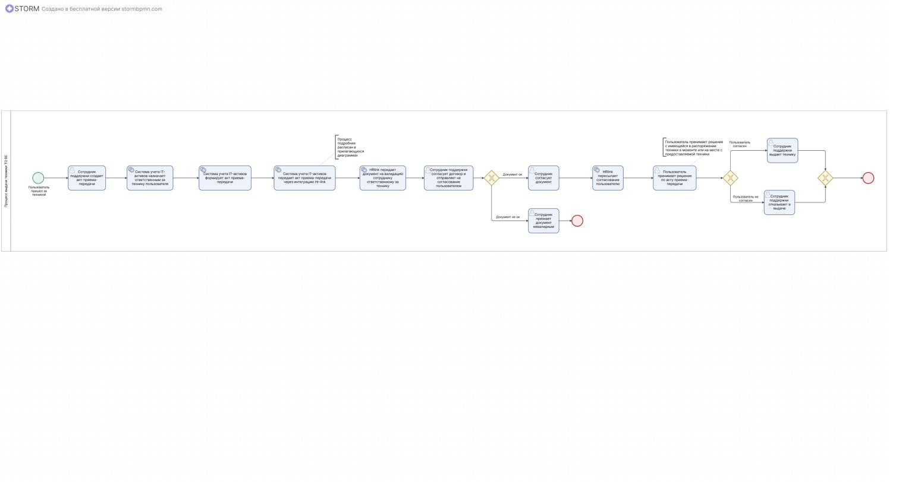
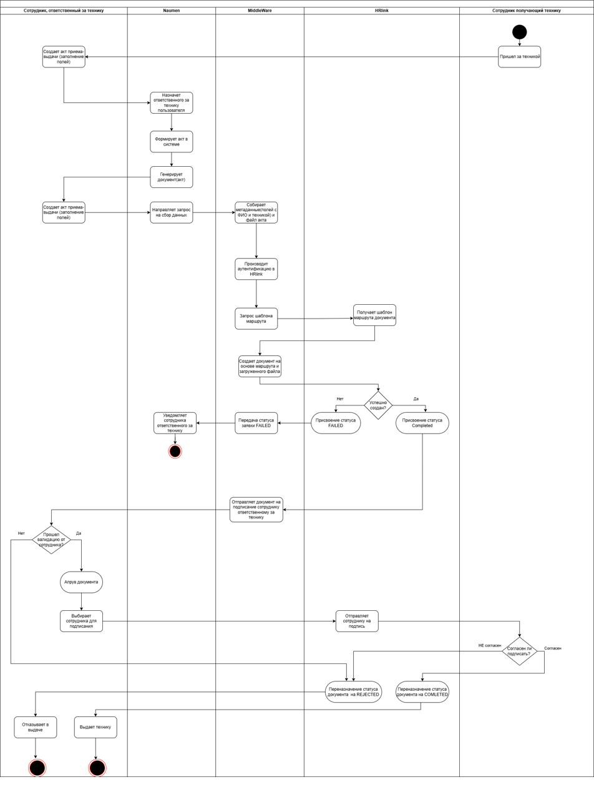
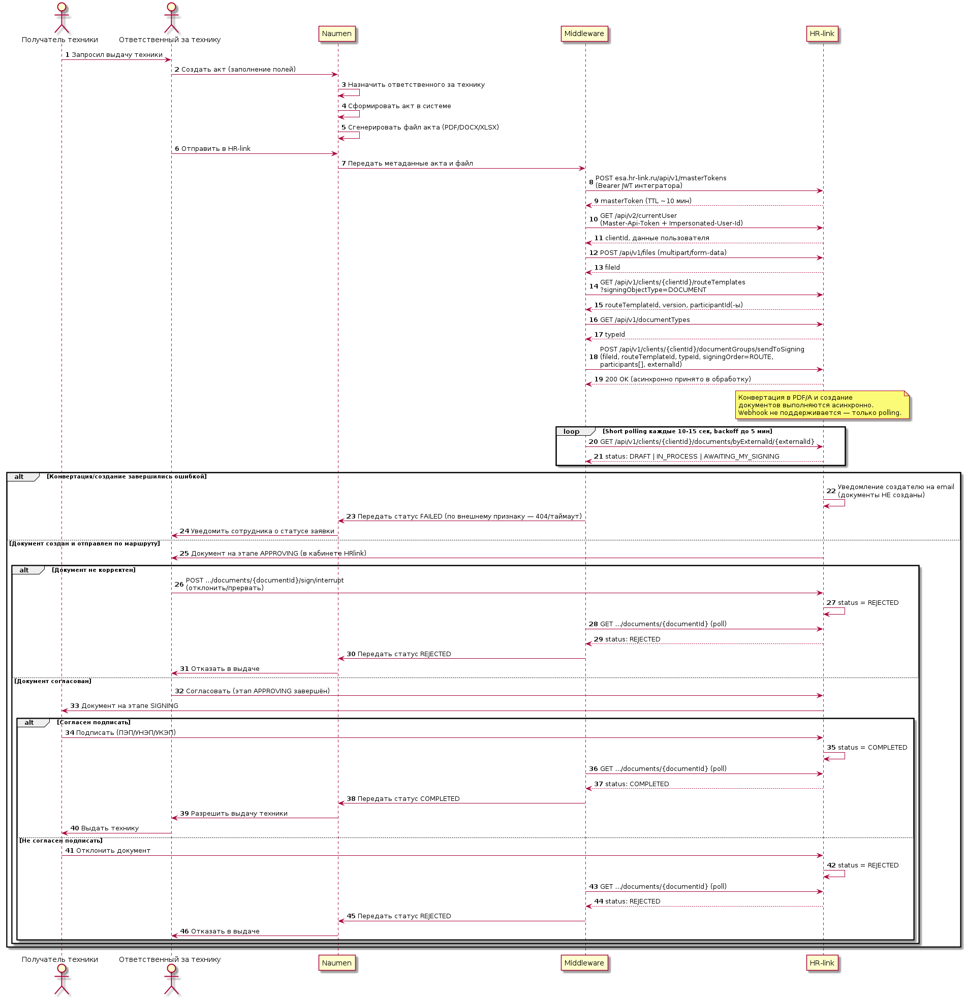
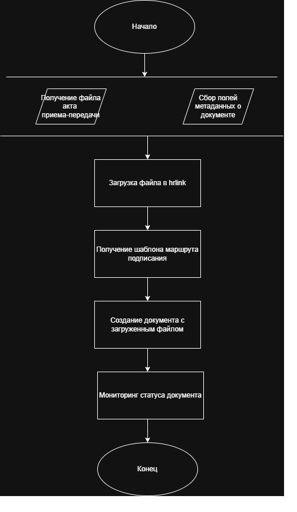

# 📈 BPMN — Автоматизация выдачи техники сотруднику

**Тип проекта:** практический кейс (стажировка)  
**Формат:** диаграммы бизнес-процесса AS-IS и TO-BE в формате BPMN, диаграмма активностей по системам и sequence-диаграмма интеграции  
**Роль:** системный аналитик

---

## 📌 Описание

Необходимо было описать процесс выдачи техники сотруднику: как в текущем виде (AS-IS) акт приёма-передачи создаётся, согласовывается и подписывается вручную, так и в целевом виде (TO-BE) — с автоматической маршрутизацией акта и его подписанием через электронный документооборот **HR-Link**, интегрированный с системой учёта заявок **Naumen SD** через промежуточный сервис **Middleware**.

Дополнительно детализирована техническая сторона интеграции: диаграмма активностей с разбивкой по системам (Naumen, Middleware, HR-Link, сотрудники) и sequence-диаграмма вызовов HR-Link API.

---

## 📎 Артефакты

**BPMN AS-IS** — текущий процесс создания и согласования акта приёма-передачи техники  

**BPMN TO-BE** — целевой процесс с автоматической валидацией и маршрутизацией документа  

**Диаграмма активностей по системам** — распределение шагов между Naumen, Middleware, HR-Link и сотрудниками  

**Sequence-диаграмма интеграции** — вызовы HR-Link API (получение токена, загрузка файла, маршрут согласования, polling статуса)  

**Схема обработки в Middleware** — внутренняя логика передачи акта в HR-Link  

---

## 🛠 Стек и инструменты

- **Нотации**: BPMN, UML Activity Diagram, UML Sequence Diagram
- **Инструменты**: Draw.io, PlantUML

---

## 🧑‍💻 Моя роль

- Анализ текущего процесса выдачи техники и выявление узких мест
- Визуализация диаграммы процесса AS-IS
- Проектирование целевого процесса и визуализация диаграммы TO-BE
- Разбивка процесса по ролям и системам (диаграмма активностей)
- Проектирование технической интеграции Naumen ↔ Middleware ↔ HR-Link
- Визуализация sequence-диаграммы вызовов HR-Link API
